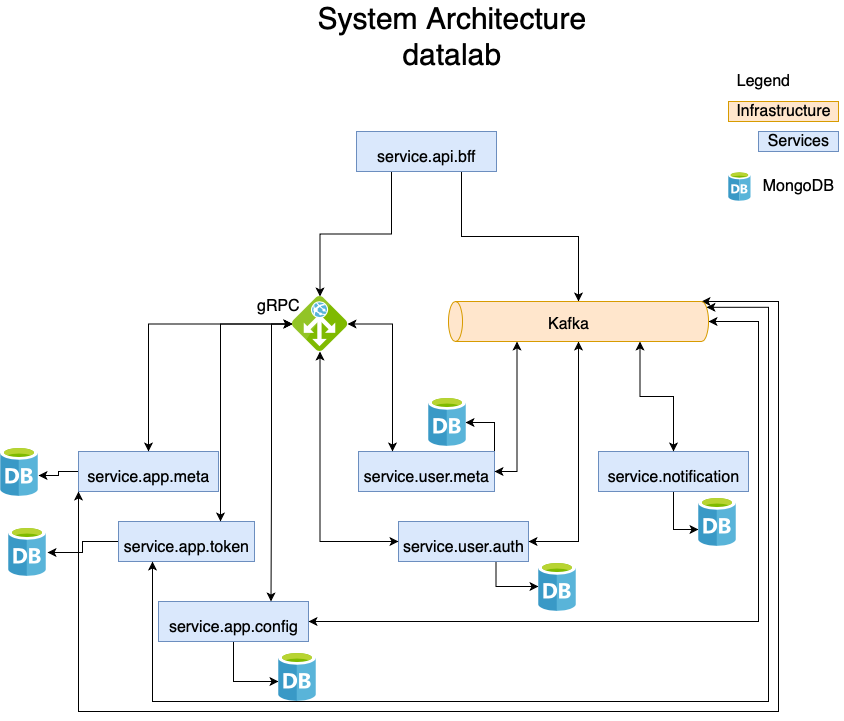

# datalab - mind your business

## Kontext und Idee 
Hintergrund des Systems ist es User-Verhalten auf Plattformen oder Web-Seiten besser zu verstehen. Dem Nutzer soll es einfach möglich sein, User-/Nutzer Verhalten nachvollziehen zu können. `datalab` wird neben bekannten Informationen, wie zum Beispiel `page views`, `views per route`, `most common browser`, es erlauben ***Conversion Rates*** zu berechnen oder auch Einblicke bieten können wie viele Nutzer sich pro Funnel-Stage aufgehalten haben (Customer Journey). Ist für den Nutzer relevant zu verstehen, wie User mit verschiedenen Elementen interagieren, können spezielle `Element Konfigurationen` gesetzt werden, welche mehr Informationen über dieses spezielle Element liefert.

## Tech-Stack
- goLang (für alle Micro-Services) https://golang.org
- gRPC für die interne Kommunikation der Services https://grpc.io
- gorilla-websocket https://github.com/gorilla/websocket
- MongoDB als Datenbank (eine Instance pro Service)
- Docker plus Docker-Swarm (perspektivisch Kubernetes) https://docs.docker.com/engine/swarm/
- Vue3 für das Frontend


## Aufbau aus User-Sicht
User geben bei der Registrierung ihre Organization an, zu welcher sie gehören (z.B. datalab.dev). Dies erlaubt die Interaktion mit anderen Kollegen mit der gleichen Organization-Domain (Cross-Organization matching is not supported - if you want it open an Issue:) ).

Auf der Platform kann jeder User **Apps** anlegen, die man Monitoren möchte und diese zielgerecht Konfigurieren. Damit andere auch mit wirken und Daten einsehen können, können Kollegen der gleichen Domain eingeladen werden. Um Daten zu generieren generiert man einen ***App-Token*** um Client-Devices zu authenticated and zu authorization. Zu gleich wird dem User beim Erstellen eines ***App-Token*** ein Code-Snippet beigefügt, welches in die Ziel Seite/Application eingebaut werden muss (entsprechende Installation Guides können der Dokumentation entnommen werden). Nach der Erstellung eines ***App-Token*** befindet sich die ***App*** in einem `locked state` und erlaubt keine weiteren Änderungen an den Konfigurationen mehr (das Entsprechen von ***Apps*** ist ohne Probleme möglich, wobei die Partition mit den Daten archiviert wird (not yet implemented)).

## Rollen in der App
Als Ersteller einen ***App*** ist auch nur dieser User Admin der ***App*** und hat volle rechte. Eingeladene Kollegen, können zwar Konfigurationen anpassen und ändern, jedoch keine ***App-Token*** erstellen, die ***App*** zurück in einen `unlocked state` setzen oder diese löschen.

## System Architecture
***behandelt nur die System Architecture der Plattform - NICHT die des Daten-Backendes***

!!!remark: Kafka is not yet implemented since Raspberry-Pi and its arch (`arm64`) does not support Kafka and Zookeeper on docker..however will be implemented ASAP once shifted to new hardware!!


## Service Responsibilities
Was die einzelnen Services machen, kann in deren `README` nachgelesen werden.
<!-- # datalab analysis platform for user activity data


# Client Library: Data Flow
The idea of this `README` is to explain how the data collection on the client-side works. Further, the session and data life-cycle will be explained as well as the data format.

## Session Life-Cycle

STATE: INIT <br>
- call to `/api/hello` to indicate session start with following data:
``` json
{   
    "session_start": "UNIX time-stamp",
    "referrer": "page current page was called from",
    "browser": "Chrome",
    "OS": "MacOS",
}
```
- pass `cookie` if present else server sets new cookie
- call-back returns `web-socket ticket` to connect to socket
- attach `Event-Listener` to document

STATE: CONNECT <br>
- connect with Web-Socket

STATE: LISTEN <br>
- `listen for events` -> `process event` -> `send to web-socket` -> `start over`

STATE: CLOSING <br>
- graceful: send `goodbye` to server
- forceful: conn interrupt -> server terminates session

## Client data we get
- `referrer` | #1, #3
- `device info` | #4
- `click` of element | #2, #1
- `X,Y` of mouse-movement (needs more thinking - what to do with the data??)
- `elpased time` mouse hovered over specific element | #4
- `URL change` | #1, #2
- `time on URL` | #4

## What to visualize?
- `Customer Journey` [1]
- `Funnel (conversion rate)` [2]
- `Compaign Tracking` [3]
- `Audience Info` [4]


## Data by event

DATA: SESSION_RECORD<br>
```json
{
    "type": "start",
    "meta": {
        "device": {"os": "Macintosh", "browser": "Chrome"},
        "referrer": "https://www.google.com",
    }
}
```
EVENT: MOUSECLICK<br>
```json
{
    "type": 0,
    "timestamp" unix-timestamp,
    "event": {
        "X": pos-mouse-x,
        "Y": pos-mouse-y,
        "target": "css class | id | name"
    }
}
```
EVENT: URLCHANGE<br>
```json
{
    "type": 0,
    "timestamp" unix-timestamp,
    "event": {
        "elapsed" time-in-seconds,
        "next": "http://awesome.dev/next"
    }
}
```
EVENT: MOUSEHOVER<br>
```json
{
    "type": 0,
    "timestamp" unix-timestamp,
    "event": {
        "elapsed": duration of no-pos-change,
        "target": "css class | id | name"
    }
}
```
EVENT: MOUSEMOVE<br>
```json
{
    "type": 1,
    "timestamp" unix-timestamp,
    "event": {
        "X": pos-mouse-x,
        "Y": pos-mouse-y,
        "elapsed": duration of no-pos-change
    }
}
```

## Docker-Swarm deployment
### CI/CD Pipe
<!-- The swarm lives on a Raspberry-PI4 (linux/arm64) consisting out of one node.
Each service (api,app,user,token,frontend) have their own `Makefile` with the `deploy` target. `make deploy` cross-compilies the executable for `linux/arm64` and builds a docker image also with cross-compilation for `linux/arm64`. Docker cross-compilation is achieved with the `docker buildx build` tool from docker which allows to build images on your local machine for a different OS/Arch. After the build `deploy` pushes the image to the `datalab-registry.dev:5000/<image-name>:<git-commit-hash>` which lives within the `swarm`. From their services can pull the latest images. -->

<!--

## Service - DNS Table (some say they can see a pattern..not sure where??)
| Service               | swarm-name                  | port in:out | credentials                |
|-----------------------|-----------------------------|-------------|----------------------------|
| gateway               | api-bff                     | 8080:8080   |                            |
| app                   | app-meta-agent              | 8003:8003   |                            |
| user                  | user-meta-agent             | 8001:8001   |                            |
| userauth              | user-auth-agent             | 8002:8002   |                            |
| config                | app-config-agent            | 8005:8005   |                            |
| apptoken              | app-token-agent             | 8006:8006   |                            |
| frontend              | frontend-web                | 80:80       |                            |
| mongo-app             | app-meta-agent-db           | 270121:27017 | app-meta-agent:secure     |
| monog-user            | user-meta-agent-db          | 27018:27017 | user-meta-agent:secure     |
| monog-config          | app-config-agent-db         | 27019:27017 | app-config-agent:secure    |
| monog-apptoken        | app-token-agent-db          | 27020:27017 | app-token-agent:secure     |
| monog-userauth        | user-auth-agent-db          | 27018:27017 | user-auth-agent:secure     |
| monog-notify          | notify-live-agent-db        | 27022:27017 | notify-live-agent:secure   |

-->

<!--
# So fare...


 -->
