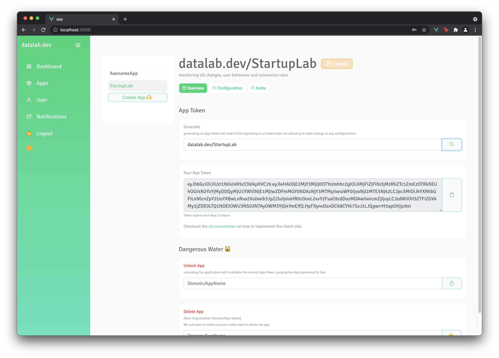
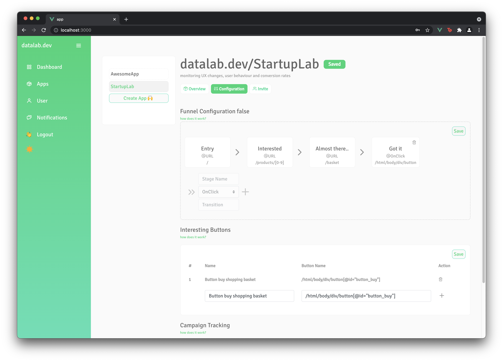
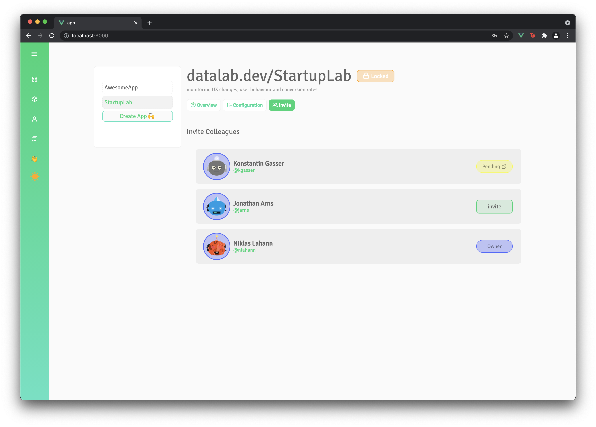

# datalab - mind your business

## Kontext und Idee 
`datalab` ist ein Plattform für Unternehmen, die mehr über Ihre User-Group erfahren wollen. Dabei erlaubt es die Plattform Daten, wie zum Beispiel 
`Conversion Rates`, `Customer Journeys`, zu tracken und als Informationen aufzubereiten. Nutzer können dabei sehr expliziert konfigurieren, wie der `Business Funnel` aus sieht und auch ganz speziell einzelne HTML-Elemente
tracken. Damit bietet `datalab` Unternehmen, neben den gängigen Metriken (`page views`, `views per route`, `most common browser`), konkrete Einblicke in die verschiedene `Stages` des definierten Funnels, detaillierte Informationen, wann und and 
welcher Stelle Kunden abspringen. 

Um `datalab` in Projekte zu integrieren, wird für jeder erstellte `App` ein unique Code-Snippet erstellt, welches auf der Client-Side injected werden kann (die dazugehörige `client library` wird bald via `node modules` und `npm` verfügbar sein)

## Manage Applications you want to monitor

## Customize what you want to monitor

## Work as a team

## Tech-Stack
- golang (für alle Micro-Services) https://golang.org
- gRPC für die interne Kommunikation der Services https://grpc.io
- gorilla-websocket https://github.com/gorilla/websocket
- MongoDB als Datenbank (eine Instance pro Service)
- Docker plus Docker-Swarm (perspektivisch Kubernetes) https://docs.docker.com/engine/swarm/
- Vue3 für das Frontend

## System Architecture
***behandelt nur die System Architecture der Plattform - NICHT die des Daten-Backendes***

FYI: Kafka is not yet implemented since Raspberry-Pi and its arch (`arm64`) does not support Kafka and Zookeeper on docker..however will be implemented ASAP once shifted to new hardware!!

## Service Responsibilities
Was die einzelnen Services machen, kann in deren `README` nachgelesen werden.
- [readme -> Service-Api-BFF](https://github.com/KonstantinGasser/datalab/tree/main/service.api.bff)

- [readme -> Service-User-Auth (not there yet...)](https://github.com/KonstantinGasser/datalab/tree/main/service.user.auth.agent)
- [readme -> Service-User-Meta (not there yet...)](https://github.com/KonstantinGasser/datalab/tree/main/service.user.meta.agent)

- [readme -> Service-App-Meta (not there yet...)](https://github.com/KonstantinGasser/datalab/tree/main/service.app.meta.agent)
- [readme -> Service-App-Config (not there yet...)](https://github.com/KonstantinGasser/datalab/tree/main/service.app.config.agent)
- [readme -> Service-App-Token (not there yet...)](https://github.com/KonstantinGasser/datalab/tree/main/service.app.token.agent)

- [readme -> Service-Notification-Live (not there yet...)](https://github.com/KonstantinGasser/datalab/tree/main/service.notification-live)
- [readme -> Service-Eventmanager-Live](https://github.com/KonstantinGasser/datalab/tree/main/service.eventmanager.live)

## Information about what an ***App*** is
User geben bei der Registrierung ihre Organization an, zu welcher sie gehören (z.B. datalab.dev). Dies erlaubt die Interaktion mit anderen Kollegen mit der gleichen Organization-Domain (Cross-Organization matching is not supported - if you want it open an Issue:) or create a Pull-Request).

Auf der Platform kann jeder User **Apps** anlegen, die man Monitoren möchte und diese zielgerecht Konfigurieren. Damit andere auch mit wirken und Daten einsehen können, können Kollegen der gleichen Domain eingeladen werden. Um Daten zu generieren generiert man einen ***App-Token*** um Client-Devices zu authenticated and zu authorization. Zu gleich wird dem User beim Erstellen eines ***App-Token*** ein Code-Snippet beigefügt, welches in die Ziel Seite/Application eingebaut werden muss (entsprechende Installation Guides können der Dokumentation entnommen werden). Nach der Erstellung eines ***App-Token*** befindet sich die ***App*** in einem `locked state` und erlaubt keine weiteren Änderungen an den Konfigurationen mehr (das Entsperren von ***Apps*** ist ohne Probleme möglich, wobei die Partition mit den Daten archiviert wird (not yet implemented)).

Als Ersteller einen ***App*** ist auch nur dieser User Admin der ***App*** und hat volle rechte. Eingeladene Kollegen, können zwar Konfigurationen anpassen und ändern, jedoch keine ***App-Token*** erstellen, die ***App*** zurück in einen `unlocked state` setzen oder diese löschen. Selbes gilt auch für `public` ***Apps***, wobei hier keine Invites möglich sind, sondern jeder aus der Organization Zugriff auf die ***App*** hat (but not admin rights)

